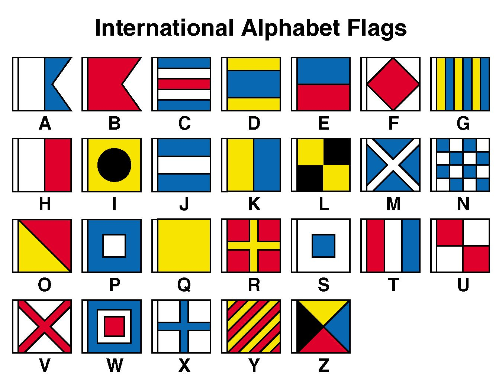

# <u>Green Flags 🟢</u>

* **Event:** Hack Havoc CTF by Cyber 
* **Problem Type:** Crypto
* **Point Value / Difficulty:** 20
## Description
Flag Frenzy In a sea of encrypted flags, your mission is to unravel the chaos and reveal the hidden truth.

Flag : CM{abcd_abcdefgh}
## Solution
The image we were given is clearly encoding of letters using country flags. I wasn't sure what tho. On searching google with very little effort I found a picture.

After this just compare.

Flag:- `CM{nato_signals}`