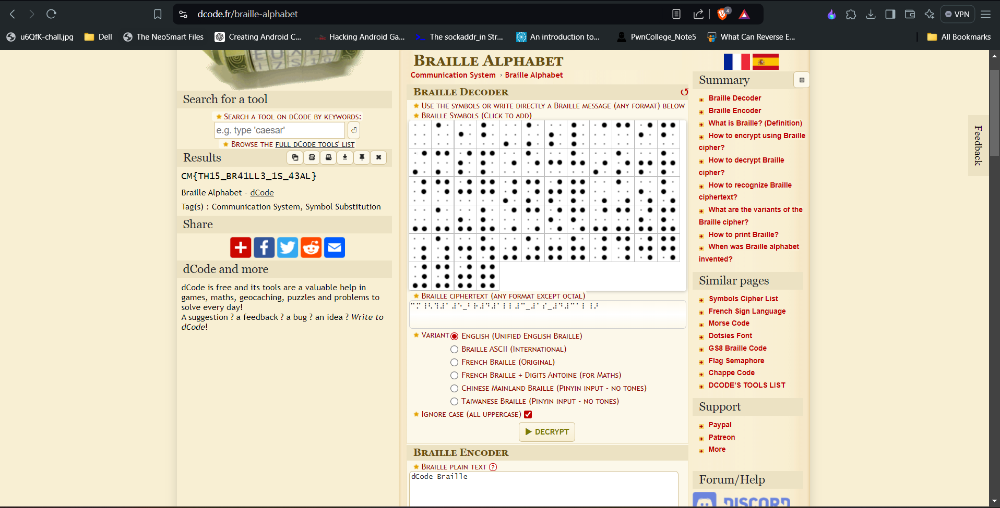

# <u>I can't see it</u>

* **Event:** Hack Havoc CTF by Cyber 
* **Problem Type:** Crypto
* **Point Value / Difficulty:** 30
## Description
In the land of secrets, where the ordinary becomes extraordinary, there’s a riddle that loves to play hide-and-seek. It's hiding in plain sight, yet elusive to the eye. Venture into the realm where invisible ink holds the clues, and remember
## Solution
Just put the braille in dcode an we have the flag.

Flag:- `CM{TH15_BR41LL3_1S_43AL}`