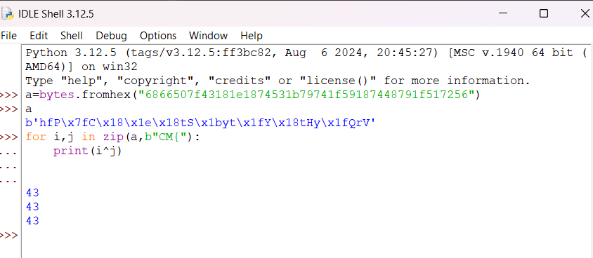
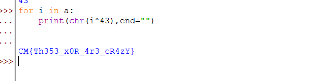

# <u>My Secret X 'V' My Secret Y</u>

* **Event:** Hack Havoc CTF by Cyber 
* **Problem Type:** Crypto
* **Point Value / Difficulty:** 80
## Description
A message from the cheeky code gremlins: Our secrets are hidden in plain sight, like a magician’s trick. Your task? Play peekaboo with bytes to reveal what’s concealed. Remember, it’s not about where they're hiding but who’s hiding!"

Hide: 6866507f43181e1874531b79741f59187448791f517256  
&  
Seek: ??????????????
## Solution
On looking at the data, the first thing that comes to mind is `xor`. Now using the knowledge of the flag format `CM{`, we first find the key.

Having found the key, just xor everything with it.

Flag:- `CM{Th353_x0R_4r3_cR4zY}`
