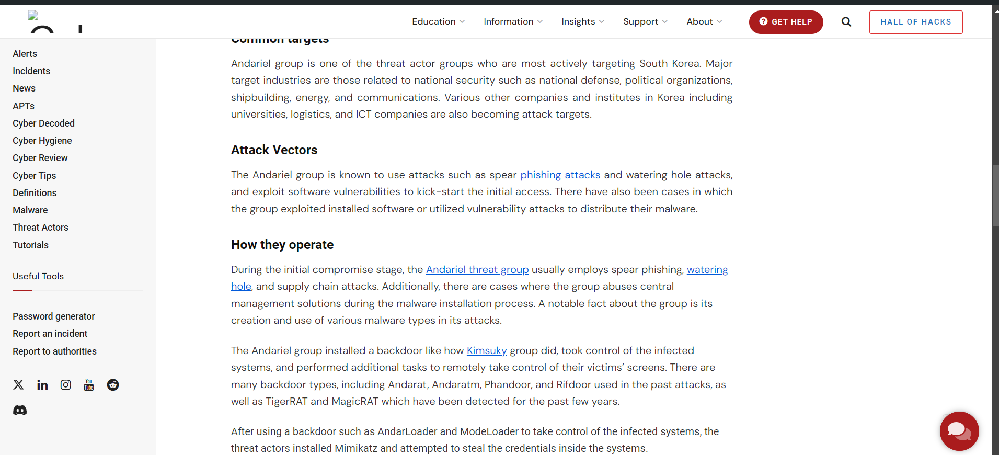

# <u>APT Intel Hunt</u>

* **Event:** Hack Havoc CTF by Cyber 
* **Problem Type:** OSINT
* **Point Value / Difficulty:** 40
## Description
ou’re up against one of the most notorious APT groups—Lazarus. These cyber troublemakers have been causing chaos, and it’s up to you to outsmart them before they can make their next move.

Word on the street is that they’ve dropped some hints about their latest scheme. A recent CyberMaterial report on their mischievous sub-group, Andariel, might just be the treasure map you need. But remember, Lazarus is like a sneaky cat—hard to catch and always up to something devious.

Can you unravel their devious plans and find the flag before they hit their next target? Put on your detective hat, crack the code, and save the day! The world’s fate might just hang in the balance. 🕵️‍♂️🔓
## Solution

Based on the description I started out with the website of Cybermaterial under `apt` to find for `Lazarus`. I did find out a post but wasn't that helpful.

Did a google search after that including the sub group name `Andariel`, and found another post.


On clicking `Andariel threat group`. It takes to a pastebin link.

```
Compromising their systems will involve a convincing phishing campaign. Ensure it's believable enough to deceive even the most vigilant employees.
 
Operations will commence once our custom malware is ready. 43 Four of our top coders are working tirelessly to craft malware capable of bypassing all known security protocols.
 
Planning for persistence within their systems is crucial. 4d We must ensure our foothold remains undetected and irremovable.
 
Thorough analysis of entry points is essential for lateral movement. 7b With multiple access routes, we'll infiltrate deeper into their network.
 
Executing the extraction phase demands precision. 34 Additional tools will be deployed to gather sensitive data and obscure our tracks.
 
Gathering unauthorized access requires coordination. 70 Every team member must be fully briefed and aware of their responsibilities.
 
Retaining the element of surprise is critical. 54 Our malware must evade detection to maintain operational secrecy.
 
Observation is key during the operation. 5f Continuous monitoring of their network activity will allow us to adapt swiftly.
 
Uninterrupted manipulation of their financial systems is necessary. 47 Success hinges on our ability to alter transactions undetected.
 
Preparation before launch is non-negotiable. 72 All systems must undergo rigorous testing to prevent any mishaps.
 
Senior members are overseeing the final stages. 30 They've provided invaluable guidance and support throughout the planning process.
 
Navigating through their systems will be challenging. 75 Once inside, we'll extract the data we need and erase all traces of our presence.
 
Laundering the stolen funds requires strategic planning. 50 By leveraging our connections, we'll ensure the money remains untraceable.
 
Final preparations are almost complete. 35 The final checks are underway to ensure no loose ends remain.
 
Zero room for error exists in this mission. 5f Our success depends on flawless execution and absolute precision.
 
Activating all stealth protocols is the last step. 4c Any lapse in judgment could compromise the entire operation.
 
Ready to proceed with the final phase. 34 Let’s make sure every team member is prepared to carry out their role.
 
Ultimate success will be achieved through careful planning. 7a We aim to maximize impact while minimizing our risk exposure.
 
System checks are concluding. 34 With all team members in position, the operation is set to launch.
 
Contingency plans are in place for unexpected complications. 52 Any deviation from the plan will be addressed promptly to ensure mission success.
 
Final adjustments to the malware are being completed. 75 Our tools will be optimized to ensure seamless execution during the operation.
 
Deployment of phishing campaigns is scheduled to begin. 35 This will initiate the infiltration phase and set the stage for subsequent actions.
 
Surveillance of target communications is underway. 7d Monitoring their interactions will provide insights into potential vulnerabilities.
```

In this text we can see numbers placed randomly. Just take all and convert back to ascii to get the flag.

```python
''.join(chr(i) for i in [0x43, 0x4d, 0x7b, 0x34, 0x70,0x54, 0x5f, 0x47,0x72,0x30, 0x75, 0x50, 0x35, 0x5f, 0x4c,0x34,0x7a,0x34,0x52,0x75,0x35,0x7d])
```

Flag:- `CM{4pT_Gr0uP5_L4z4Ru5}`