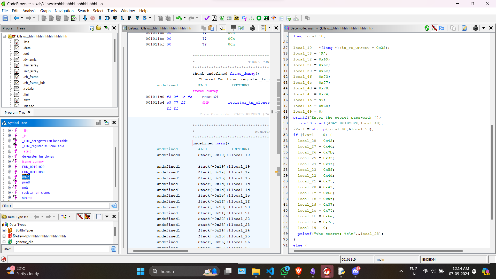

# <u>Go Crazy</u>

* **Event:** Hack Havoc CTF by Cyber 
* **Problem Type:** Rev
* **Point Value / Difficulty:** 30
## Description
In a small, dimly lit room, a determined hacker named killswxtch sits in front of an old, flickering computer screen. They find a book with a note that reads, "Check the sequence." Using this clue, killswxtch deciphers the password and enters it, unlocking a hidden door that reveals secret manuscripts.
## Solution
Putting the binary in a decompiler (I used `ghidra`), We get the following decompilation.


It is clearly seen that on entering the password, the secret is getting printed. So I just took the byte values starting from `local_28 to local_1a`, and converted back to ascii and got the flag.

```python
bytes.fromhex("434d7b354f5f4d7543685f37756e7d")
```
Output:- `b'CM{5O_MuCh_7un}'`

Flag :- `CM{5O_MuCh_7un}`
