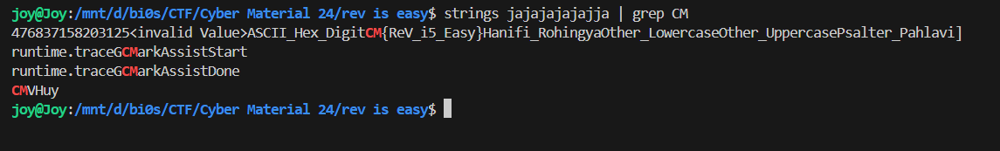

# <u>Rev is easy!</u>

* **Event:** Hack Havoc CTF by Cyber 
* **Problem Type:** Rev
* **Point Value / Difficulty:** 20
## Description
Welcome to the “Rev is Easy!” challenge at CyberMaterial! Think you’re clever enough to outsmart our file? Prove that “Rev” isn’t just short for “Reverse Engineering,” but also for “Really Easy Victory!”
## Solution
A simple `strings` on the binary and grep reveals the flag.

Flag:- `CM{ReV_i5_Easy}`