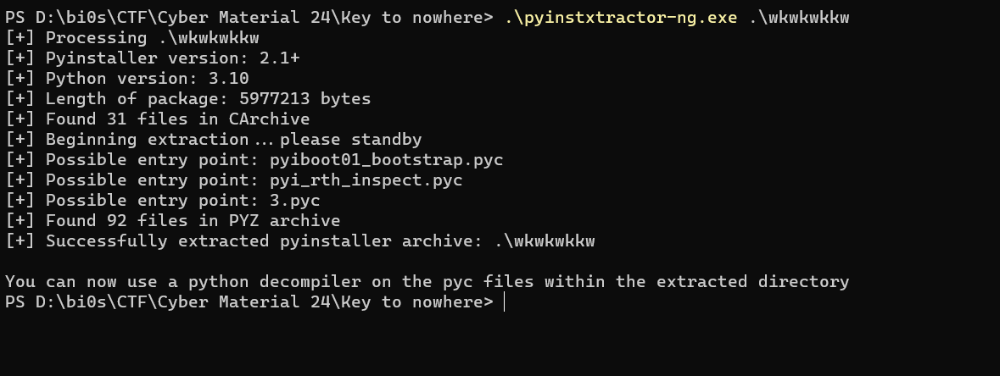

# <u>The Key to Nowhere</u>

* **Event:** Hack Havoc CTF by Cyber 
* **Problem Type:** Rev
* **Point Value / Difficulty:** 60
## Description
You’ve got your hands on a mysterious file called wkwkwkkw, and the word on the street is that only those with a sharp mind and a good sense of humor can unlock its secrets. Legend says it holds the key to something... static, perhaps? Who knows?

## Solution
At first I decompile the binary using ghidra. On checking the stripped `entry` and just going into the rabbit hole a bit, I notice `FUN_004032a0("Could not load PyInstaller\'s embedded PKG archive from the executable (%s)\n"`

The thing to be noted is `PyInstaller`. SO the binary is packed using `PyInstaller`. To unpack this a tool called [PyExtractor](https://github.com/extremecoders-re/pyinstxtractor) is available on github.

Just run the command with the binary:-
`.\pyinstxtractor-ng.exe .\wkwkwkkw`

And it unpacks the packed file into a separate folder.


Now inside the folder we have `3.pyc`. A `pyc` file. To read the actual code from a pyc file, there is another tool called [pycdc](https://github.com/zrax/pycdc). It is also available on github.

Build the tool and run the following command:-
`/mnt/d/bi0s/pycdc/pycdc 3.pyc`

This will show the original python code.

```python
# Source Generated with Decompyle++
# File: 3.pyc (Python 3.10)


def xor_encrypt(data, key):
    '''Encrypt or decrypt data using XOR with the given key.'''
    return None((lambda .0 = None: for i, c in .0:
chr(ord(c) ^ ord(key[i % len(key)])))(enumerate(data)))


def get_hidden_key():
    '''Retrieve the hidden key.'''
    return ''.join((lambda .0: for c in .0:
chr(c))((83, 84, 65, 84, 73, 67, 75, 69, 72)))


def get_hidden_flag():
    '''Retrieve the hidden flag.'''
    return ''.join((lambda .0: for c in .0:
chr(c))((82, 51, 86, 95, 68, 52, 84, 52, 95, 72, 51, 114, 79)))


def main():
    key = get_hidden_key()
    flag = get_hidden_flag()
    encrypted_flag = xor_encrypt(flag, key)
    print('Welcome to CyberMaterial, where only the brave dare to crack the code!')
    response = input('Do you think you can outsmart the system? (yes/no): ').strip().lower()
    if response == 'yes':
        user_input = input('Alright, savvy one! Enter the secret key: ')
        if user_input == key:
            decrypted_flag = xor_encrypt(encrypted_flag, key)
            print(f'''Congratulations! Here\'s your flag: CM{{{decrypted_flag}}}''')
            return None
        None('Oops! Incorrect key. Try again.')
        return None
    None('I see you’re a true codebreaker! No key needed. The flag is hidden, but you’re smart enough to find it. Good luck!')

if __name__ == '__main__':
    main()
    return None
```

Now we can see the `get_hidden_flag`. I just took the list, and converted and got the flag.

```python
''.join(chr(i)for i in [82, 51, 86, 95, 68, 52, 84, 52, 95, 72, 51, 114, 79])
```

Output:- "R3V_D4T4_H3rO"

Flag:- `CM{R3V_D4T4_H3rO}`