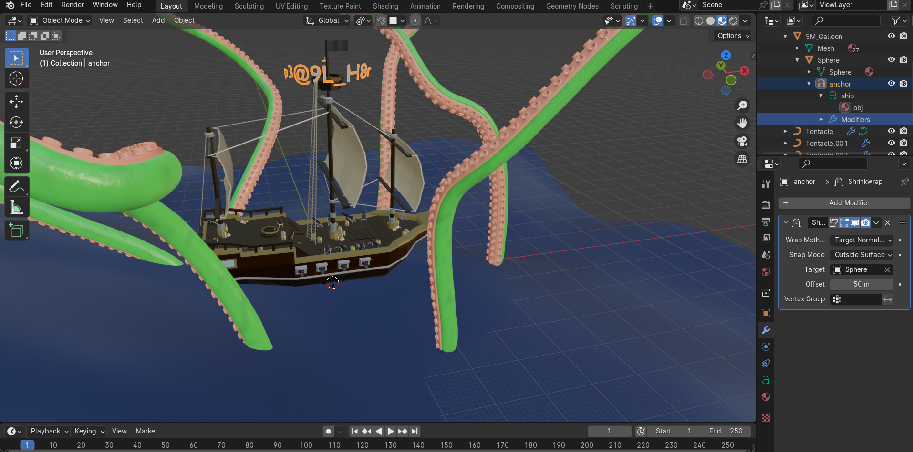

# ShipWreck

**Event:** PearlCTF 
**Category:** Misc

**Description** 
I hope the pearl wasn't lost in the shipwreck. Enclose the flag in pearl{}

## Solution
Well, it is a blender file, and also my first time dealing with it. They told that the flag is in the shipwreck. On opening the file in blender we see a ship surrounded by tentacles probably of a kraken.

I check the ship by changing the camera angles and find nothing.

Then I open the modifier of the ship and try by changing the offset to `50 m` and I unintentionally get the flag.

Flag: `pearl{p3@9L_H8r}`