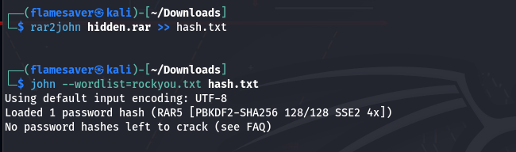
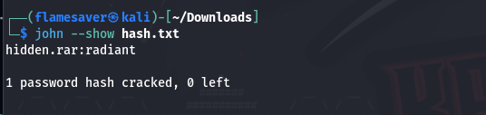

# got-you

**Event:** PearlCTF<br>
**Category:** Forenscics

**Description**<br>
My friend, an avid Valorant fan, downloaded a captivating wallpaper only to find out I have jokingly REGISTERED a password on it . Now, he's turning to you for help in cracking the password so he can see the wallpaper. Can you help him crack the code and grant access to the wallpaper?

**Solution**<br>
At first I did `strings` on the given file an stored the output in a `txt` file.
```
strings dump_2.raw > out.txt
```

Now at first I tried to `grep` the word `pearl` inside the txt file and this time there wasn't anything that looked like a flag.

Now the description says `valorant`. So I try to grep `valorant` irrespective of the case.
```
cat out.txt | grep -i valorant
```

On reading through the results we find something interesting, the word `Radiant` as it is the highest rank in Valorant.
```
In the sprawling universe of Valorant, hidden beneath the surface of our reality, lies a secret organization known as the "Order of the Eclipse." Founded centuries ago by a clandestine group of scholars and mystics, the Order sought to maintain the delicate balance between the material world and the mysterious realm of the "Radiant."
```
So now we grep the word `Radiant`

```
cat out.txt | grep -i radiant
```
Among the results we find a `mega.nz link`.<br>
Link: `https://mega.nz/file/ZjgRDKoY#GJwW9OnSI6LfuJE-syODo4cSHkxcdvMkD_Gt1HmvsLI`

We go to that link and find a password protected `rar file`.

Now we use `john-the-ripper` to crack the password.



So if we ran the first two commands in order , we get the password. As I have already cracked it it does not show up until i use the flag --show.



As we can see the password to the rar file is radiant. Using it we get to view the image which contains the flag :)  
Flag:- `pearl{th4y_4r3_s0_d34d}`

