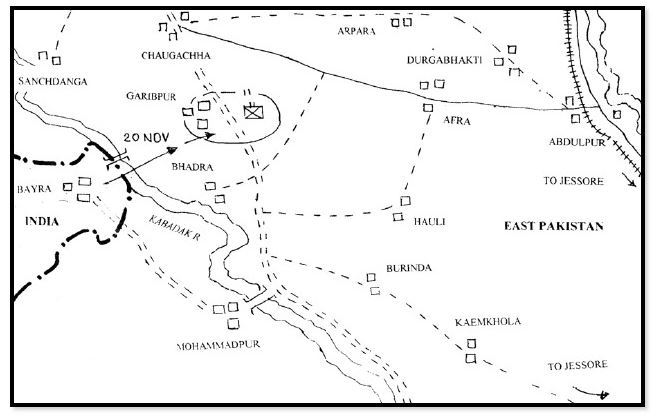
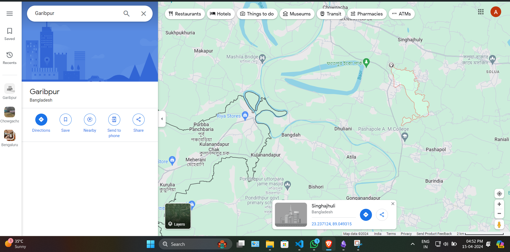

# <u>BIBBA Part 3</u>

* **Event:** ShunyaCTF arambha
* **Problem Type:** OSINT
* **Difficulty:** Medium

## Description
There's no osint without geoguesser... this one is pretty simple, find out the location co-ordinates of the **AREA** where the battle took place. I wish googlemaps could've worked that time :(((

> Note: you only need to be precise upto 2 decimals, i.e: 99.32 N, 29.06 E This has been done because there's no exact location where battles are fought so just a generic nearby approx location would do. Flag Format: 0CTF{XX.XX,YY.YY}
## Solution
First I fixed the corrupted image using https://hexed.it/. The changes which had to be made:-
- `CNG` to `PNG`
- `ADHD` to `IHDR`
- `pHYs` to `pHYS`
- `GYAT` to `IDAT`

After fixing these critical chunks and saving the image we get the proper image of the battlefield.

After solving the part 1 and part 2, this part requires an approx. location of the battlefield. While looking through the articles, I found this one:- https://www.bssnews.net/news/99954

Inside we find the approx. image:-

When we search Garibpur, Bangladesh on google maps.

When we approximately match  the image, at the tip area is where the battle happened. The flag we get is `0CTF{23.23,89.04}`. I got this after quite a few trial and error during the CTF.