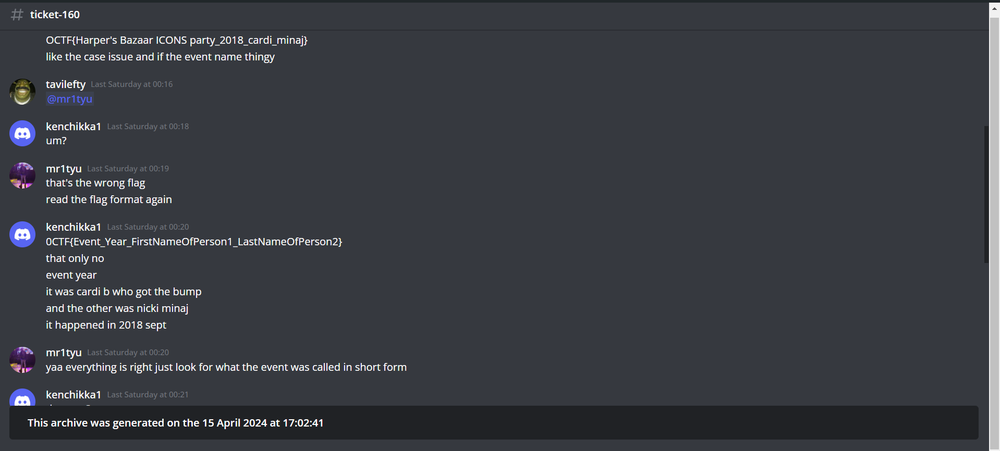

# <u>BIBBA Part 3</u>

* **Event:** ShunyaCTF arambha
* **Problem Type:** OSINT
* **Difficulty:** Medium

## Description
Yo, so imagine this crazy drama dive, fam! You got two major rap stars going at it like it's nobody's business, taking their beef from tweets to real-life blows at some fancy event. One even came out with a massive bump on her forehead,yeah, that's your clue, no cap fr dude, like, it was straight-up insane! And then, there's this record label, right? Rumor has it they were trading avocado toast recipes or arguing over who's got the better Spotify playlist. They're in deep trouble, with lawsuits flying left and right, shady deals going down, it's like watching a Netflix thriller unfold, fr. But wait, there's more! There's this whole motorsport incident that went down, with rumors flying about who was involved and what actually went down, man. It's like a whole conspiracy theory brewing, with twists and turns hotter than the tea we spill, you feel me? And speaking of brainstorming, I heard they were sipping on some green, but not the organic kind you find at Whole Foods. Nah, bruh, we're talking that Netflix series-level drama, with more plot twists than a Kanye West tweet. So grab your popcorn and get ready for the tea, 'cause this story's about to get wilder than my DMs after a breakup!

0CTF{Event_Year_FirstNameOfPerson1_LastNameOfPerson2}
## Solution

I will be honest. I just put the description on chatGPT and some prompts and searching, I was able to get most of the flag. 
Here is the link:- https://chat.openai.com/share/461b1bda-51cd-4cff-aef5-20487da1c11d
The event name(Harper's Bazaar ICONS party_2018_cardi_minaj) I was not sure how to put in the flag. That's why I opened a ticket and asked the organizers about it.

Then he asked for the short form and hence the last prompt and yeah, hence the flag:-`0CTF{NYFW_2018_Cardi_Minaj}`