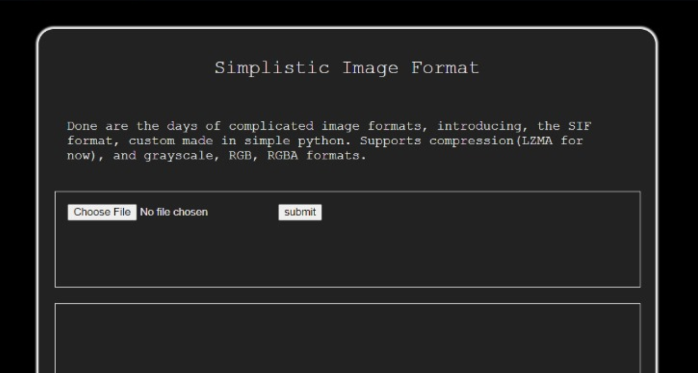
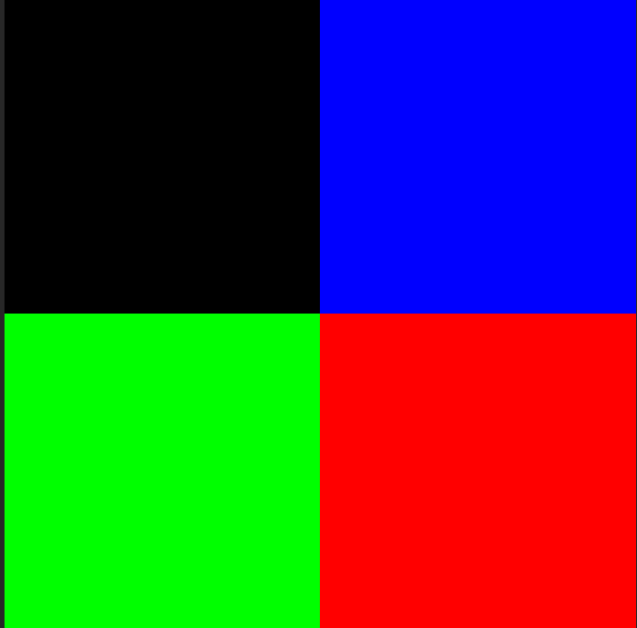
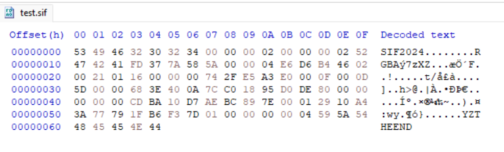
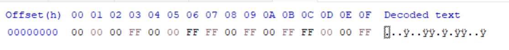
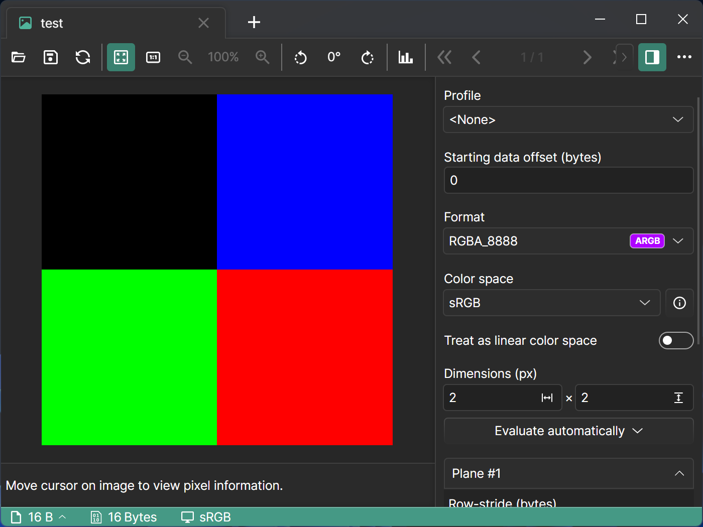
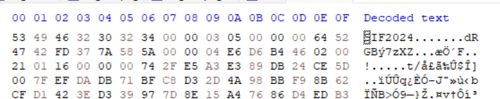
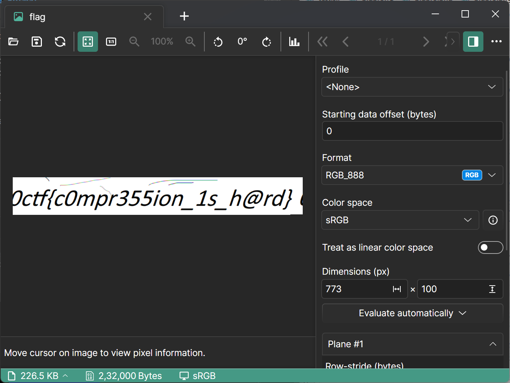

# Simplistic Image Format

- **Event:** ShunyaCTF Aarambha
- **Problem Type:** RE
- **Difficulty** Medium

## Description
Some prefer jpg, some prefer png, I prefer hating myself and spending 2 days on making my own image format.

## Solution
The challenge gives us a web app that converts a given image into SIF, a custom image format.

 We can upload a test image and examine the generated SIF file. The test image is a 2x2 PNG with four different colours, created in Paint.

Let's look at the file in a hex editor..

The file has a header `SIF2024`, followed by two 32-bit numbers that we can infer are the dimensions are the image. Next is the text `RGBA`, implying that the underlying bitmap has four channels. This is followed by the bytes `FD 37 7A 58 5A`, which is the file header for XZ compressed blobs. This was discovered by opening the file in 7zip (a hint from the `7z` text) in the info panel.

We can extract the .sif file directly with 7zip - it will detect the XZ header within it and extract the data.

Observing the 16 bytes, we can infer that this is the raw pixels as a bitmap in RGBA form. Based on the colours, we can see that it is in row-major order.

We found an [open-source program](https://github.com/carina-studio/PixelViewer) that lets you view raw bitmaps in a known pixel format as an image.

This renders our test image correctly with the right settings. Now, we can replicate this on the flag image.

Evidently, this is a 773 x 100 (305h x 64h) RGB image. Extracting it and viewing it in PixelViewer with these parameters, we get the flag.

> Note: The prefix `0ctf` was replaced with `0CTF` before submitting.

Flag: `0CTF{c0mpr355ion_1s_h@rd}`