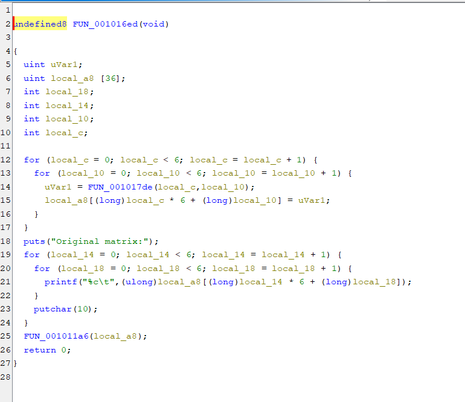
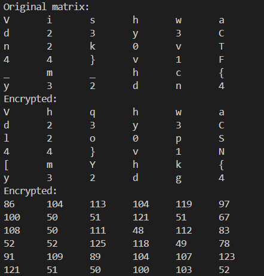

# <u>Sandese aate hai</u>

* **Event:** VishwaCTF
* **Problem Type:** RE
* **Point Value / Difficulty:** Medium

## Description
A friend pranked me by encrypting my letter but gave me the program by which he encrypted it. Can you help me decrypt it?

Replace one of the s with w at the end after receiving the letter

## Solution
In this challenge, we were given the program file and the encrypted text in the form of ASCII matrix.

So I first decompiled the given binary using Ghidra and saw that the original matrix was getting printed.

On seeing this I simply can the program and got the original matrix. Now on closer inspection we see that the flag is in a spiral matrix form.

Flag:- `VishwaCTF{4nd23y_4nd23y3v1ch_m42k0v}`