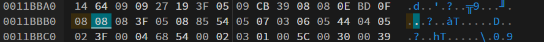

# GCC_Chat

This is an android reversing challenge which has 2 parts.

## Part 1
### Description
One of our members made an android application so that we can discuss and prepare the CTF safely and confidentially.

However, to avoid having to create an account for each person, it seems that one account has been shared with all the members and hidden somewhere in the app...

So in this part we have to find out an `username` and `password` which is somewhere hidden in the apk itself.

On analysing the apk in `jadx` we get to know that it is a `react native app`. For react native apps, the file which controls everything in the app is `index.android.bundle`. It is present in `assests`. We use `apktool` to get the files. The `index.android.bundle` is a `hermes` bytecode. We use a tool [hermes-dec](https://github.com/P1sec/hermes-dec) by [P1sec](https://github.com/P1sec) to decompile the bundle file into both assembly and js.

In the js file we search `Wrong username or password` and we find `GCC_Staff` as the username nearby only. The password is also there in SHA-256 encoded form. Use an online decoder and we have the password as `P4ssw0rd`.


Use these credentials and log in the app. You have the first flag.

Flag: `GCC{C0ngr4tz_f0r_th1s_f1rst_fl4g_y0ung_R3vers3r}`

## Part 2
### Description
Okey you found our shared account, but Im sure you will never find a way to send the message `Gimme that flag you silly boy!` since the button is disabled...

This challenge is the sequel of GCC_Chat 1/2 and use the same application.

Now we see that a button at the bottom is disabled and in the chat the author tells that `React Native is cool and can be patchd sometimes!`. So we know that we have to patch the bytecode somehow.

First we need to find the part of the code where the button is disabled. I searched the text written on the button which took me here.


We see that `r8.enabled`. Looks sus. I searched it and I come somewhere here.

We see that `r8 = !r8`. So its getting inverted. So now we should patch it in the bytecode itself.
Now we get the `assembly code` of the `index.android.bundle` using `hermes-dec`. Now we should find the assembly equivalent of `r8 = !r8`. On checking the assembly pattern we write the equivalent as `<Not>: <Reg8: 8, Reg8: 8>`and search it. It takes us to that portion. 

```
=> [Function #6437 "GCC_Chat" of 501 bytes]: 2 params, frame size=23, env size=5, read index sz=14, write index sz=2, strict=0, exc handler=0, debug info=0  @ offset 0x0011b9d8

Bytecode listing:

==> 00000000: <CreateEnvironment>: <Reg8: 9>
==> 00000002: <GetEnvironment>: <Reg8: 5, UInt8: 0>
==> 00000005: <LoadFromEnvironment>: <Reg8: 0, Reg8: 5, UInt8: 1>
==> 00000009: <GetByIdShort>: <Reg8: 1, Reg8: 0, UInt8: 1, string_id: 124>  # String: 'default' (Identifier)
==> 0000000e: <LoadConstUndefined>: <Reg8: 3>
==> 00000010: <LoadParam>: <Reg8: 0, UInt8: 1>
==> 00000013: <Call2>: <Reg8: 0, Reg8: 1, Reg8: 3, Reg8: 0>
==> 00000018: <LoadConstFalse>: <Reg8: 0>
==> 0000001a: <GetGlobalObject>: <Reg8: 8>
==> 0000001c: <PutById>: <Reg8: 8, Reg8: 0, UInt8: 1, string_id: 4029>  # String: 'enabled' (Identifier)
==> 00000022: <LoadFromEnvironment>: <Reg8: 0, Reg8: 5, UInt8: 2>
==> 00000026: <GetByIdShort>: <Reg8: 2, Reg8: 0, UInt8: 2, string_id: 250>  # String: 'useState' (Identifier)
==> 0000002b: <LoadConstUInt8>: <Reg8: 1, UInt8: 1>
==> 0000002e: <NewArray>: <Reg8: 0, UInt16: 3>
==> 00000032: <NewObjectWithBuffer>: <Reg8: 4, UInt16: 4, UInt16: 4, UInt16: 2570, UInt16: 1820>  # Object: {'id': 1, 'sender': 'Al-oxos', 'text': "Guys, I will do an Android reverse challenge for the CTF, it's gonna be fun for sure!", 'timestamp': '04:30'}
==> 0000003c: <PutOwnByIndex>: <Reg8: 0, Reg8: 4, UInt8: 0>
==> 00000040: <LoadConstUInt8>: <Reg8: 6, UInt8: 2>
==> 00000043: <NewObjectWithBuffer>: <Reg8: 4, UInt16: 4, UInt16: 4, UInt16: 2570, UInt16: 867>  # Object: {'id': 2, 'sender': 'Shadowwws', 'text': "Look at the time, it's one more time a drunk dumb idea...", 'timestamp': '11:30'}
==> 0000004d: <PutOwnByIndex>: <Reg8: 0, Reg8: 4, UInt8: 1>
==> 00000051: <NewObjectWithBuffer>: <Reg8: 4, UInt16: 4, UInt16: 4, UInt16: 2570, UInt16: 1832>  # Object: {'id': 3, 'sender': 'Al-oxos', 'text': null, 'timestamp': '12:00'}
==> 0000005b: <LoadFromEnvironment>: <Reg8: 7, Reg8: 5, UInt8: 4>
==> 0000005f: <GetById>: <Reg8: 10, Reg8: 7, UInt8: 3, string_id: 9866>  # String: 'f1' (Identifier)
==> 00000065: <LoadConstString>: <Reg8: 7, string_id: 1043>  # String: 'Nah trust me, React Native is cool and can even be patched sometimes!' (String)
==> 00000069: <Add>: <Reg8: 7, Reg8: 7, Reg8: 10>
==> 0000006d: <PutById>: <Reg8: 4, Reg8: 7, UInt8: 2, string_id: 116>  # String: 'text' (Identifier)
==> 00000073: <PutOwnByIndex>: <Reg8: 0, Reg8: 4, UInt8: 2>
==> 00000077: <Call2>: <Reg8: 2, Reg8: 2, Reg8: 3, Reg8: 0>
==> 0000007c: <LoadFromEnvironment>: <Reg8: 0, Reg8: 5, UInt8: 0>
==> 00000080: <GetByIdShort>: <Reg8: 0, Reg8: 0, UInt8: 1, string_id: 124>  # String: 'default' (Identifier)
==> 00000085: <Call3>: <Reg8: 0, Reg8: 0, Reg8: 3, Reg8: 2, Reg8: 6>
==> 0000008b: <LoadConstZero>: <Reg8: 2>
==> 0000008d: <GetByVal>: <Reg8: 13, Reg8: 0, Reg8: 2>
==> 00000091: <StoreToEnvironment>: <Reg8: 9, UInt8: 0, Reg8: 13>
==> 00000095: <GetByVal>: <Reg8: 0, Reg8: 0, Reg8: 1>
==> 00000099: <StoreToEnvironment>: <Reg8: 9, UInt8: 1, Reg8: 0>
==> 0000009d: <LoadFromEnvironment>: <Reg8: 0, Reg8: 5, UInt8: 2>
==> 000000a1: <GetByIdShort>: <Reg8: 4, Reg8: 0, UInt8: 2, string_id: 250>  # String: 'useState' (Identifier)
==> 000000a6: <LoadConstString>: <Reg8: 0, string_id: 3752>  # String: '' (Identifier)
==> 000000aa: <Call2>: <Reg8: 4, Reg8: 4, Reg8: 3, Reg8: 0>
==> 000000af: <LoadFromEnvironment>: <Reg8: 0, Reg8: 5, UInt8: 0>
==> 000000b3: <GetByIdShort>: <Reg8: 0, Reg8: 0, UInt8: 1, string_id: 124>  # String: 'default' (Identifier)
==> 000000b8: <Call3>: <Reg8: 0, Reg8: 0, Reg8: 3, Reg8: 4, Reg8: 6>
==> 000000be: <GetByVal>: <Reg8: 12, Reg8: 0, Reg8: 2>
==> 000000c2: <StoreToEnvironment>: <Reg8: 9, UInt8: 2, Reg8: 12>
==> 000000c6: <GetByVal>: <Reg8: 11, Reg8: 0, Reg8: 1>
==> 000000ca: <StoreToEnvironment>: <Reg8: 9, UInt8: 3, Reg8: 11>
==> 000000ce: <CreateClosure>: <Reg8: 0, Reg8: 9, function_id: 6438>  # Function: [#6438 getCurrentHoursMinutes of 102 bytes]: 1 params @ offset 0x0011bbcd
==> 000000d3: <StoreToEnvironment>: <Reg8: 9, UInt8: 4, Reg8: 0>
==> 000000d7: <LoadFromEnvironment>: <Reg8: 0, Reg8: 5, UInt8: 3>
==> 000000db: <GetByIdShort>: <Reg8: 2, Reg8: 0, UInt8: 4, string_id: 40>  # String: 'StyleSheet' (Identifier)
==> 000000e0: <GetByIdShort>: <Reg8: 1, Reg8: 2, UInt8: 5, string_id: 118>  # String: 'create' (Identifier)
==> 000000e5: <NewObject>: <Reg8: 0>
==> 000000e7: <NewObjectWithBuffer>: <Reg8: 4, UInt16: 3, UInt16: 3, UInt16: 2580, UInt16: 1844>  # Object: {'flex': 1, 'padding': 16, 'marginTop': 40}
==> 000000f1: <PutNewOwnById>: <Reg8: 0, Reg8: 4, string_id: 4008>  # String: 'container' (Identifier)
==> 000000f6: <NewObject>: <Reg8: 4>
==> 000000f8: <LoadConstUInt8>: <Reg8: 6, UInt8: 20>
==> 000000fb: <PutNewOwnById>: <Reg8: 4, Reg8: 6, string_id: 10763>  # String: 'marginTop' (Identifier)
==> 00000100: <PutNewOwnById>: <Reg8: 0, Reg8: 4, string_id: 5071>  # String: 'messagesContainer' (Identifier)
==> 00000105: <Call2>: <Reg8: 10, Reg8: 1, Reg8: 2, Reg8: 0>
==> 0000010a: <LoadFromEnvironment>: <Reg8: 0, Reg8: 5, UInt8: 5>
==> 0000010e: <GetByIdShort>: <Reg8: 2, Reg8: 0, UInt8: 6, string_id: 177>  # String: 'jsxs' (Identifier)
==> 00000113: <LoadFromEnvironment>: <Reg8: 0, Reg8: 5, UInt8: 3>
==> 00000117: <GetByIdShort>: <Reg8: 1, Reg8: 0, UInt8: 7, string_id: 47>  # String: 'View' (Identifier)
==> 0000011c: <NewObject>: <Reg8: 0>
==> 0000011e: <GetById>: <Reg8: 4, Reg8: 10, UInt8: 8, string_id: 4008>  # String: 'container' (Identifier)
==> 00000124: <PutNewOwnByIdShort>: <Reg8: 0, Reg8: 4, string_id: 238>  # String: 'style' (Identifier)
==> 00000128: <LoadFromEnvironment>: <Reg8: 4, Reg8: 5, UInt8: 5>
==> 0000012c: <GetByIdShort>: <Reg8: 7, Reg8: 4, UInt8: 9, string_id: 176>  # String: 'jsx' (Identifier)
==> 00000131: <LoadFromEnvironment>: <Reg8: 4, Reg8: 5, UInt8: 3>
==> 00000135: <GetById>: <Reg8: 6, Reg8: 4, UInt8: 10, string_id: 4971>  # String: 'FlatList' (Identifier)
==> 0000013b: <NewObject>: <Reg8: 4>
==> 0000013d: <PutNewOwnByIdShort>: <Reg8: 4, Reg8: 13, string_id: 123>  # String: 'data' (Identifier)
==> 00000141: <CreateClosure>: <Reg8: 13, Reg8: 9, function_id: 6440>  # Function: [#6440 keyExtractor of 19 bytes]: 2 params @ offset 0x0011bcdc
==> 00000146: <PutNewOwnById>: <Reg8: 4, Reg8: 13, string_id: 5880>  # String: 'keyExtractor' (Identifier)
==> 0000014b: <CreateClosure>: <Reg8: 13, Reg8: 9, function_id: 6441>  # Function: [#6441 renderItem of 156 bytes]: 2 params @ offset 0x0011bcef
==> 00000150: <PutNewOwnById>: <Reg8: 4, Reg8: 13, string_id: 5875>  # String: 'renderItem' (Identifier)
==> 00000155: <GetById>: <Reg8: 10, Reg8: 10, UInt8: 11, string_id: 5071>  # String: 'messagesContainer' (Identifier)
==> 0000015b: <PutNewOwnByIdShort>: <Reg8: 4, Reg8: 10, string_id: 238>  # String: 'style' (Identifier)
==> 0000015f: <Call3>: <Reg8: 6, Reg8: 7, Reg8: 3, Reg8: 6, Reg8: 4>
==> 00000165: <NewArray>: <Reg8: 4, UInt16: 3>
==> 00000169: <PutOwnByIndex>: <Reg8: 4, Reg8: 6, UInt8: 0>
==> 0000016d: <LoadFromEnvironment>: <Reg8: 6, Reg8: 5, UInt8: 5>
==> 00000171: <GetByIdShort>: <Reg8: 10, Reg8: 6, UInt8: 9, string_id: 176>  # String: 'jsx' (Identifier)
==> 00000176: <LoadFromEnvironment>: <Reg8: 6, Reg8: 5, UInt8: 3>
==> 0000017a: <GetById>: <Reg8: 7, Reg8: 6, UInt8: 12, string_id: 4802>  # String: 'TextInput' (Identifier)
==> 00000180: <NewObject>: <Reg8: 6>
==> 00000182: <LoadConstString>: <Reg8: 13, string_id: 1710>  # String: 'Enter your message' (String)
==> 00000186: <PutNewOwnById>: <Reg8: 6, Reg8: 13, string_id: 5839>  # String: 'placeholder' (Identifier)
==> 0000018b: <PutNewOwnByIdShort>: <Reg8: 6, Reg8: 12, string_id: 21>  # String: 'value' (Identifier)
==> 0000018f: <PutNewOwnById>: <Reg8: 6, Reg8: 11, string_id: 7409>  # String: 'onChangeText' (Identifier)
==> 00000194: <Call3>: <Reg8: 6, Reg8: 10, Reg8: 3, Reg8: 7, Reg8: 6>
==> 0000019a: <PutOwnByIndex>: <Reg8: 4, Reg8: 6, UInt8: 1>
==> 0000019e: <LoadFromEnvironment>: <Reg8: 6, Reg8: 5, UInt8: 5>
==> 000001a2: <GetByIdShort>: <Reg8: 7, Reg8: 6, UInt8: 9, string_id: 176>  # String: 'jsx' (Identifier)
==> 000001a7: <LoadFromEnvironment>: <Reg8: 5, Reg8: 5, UInt8: 3>
==> 000001ab: <GetById>: <Reg8: 6, Reg8: 5, UInt8: 13, string_id: 4086>  # String: 'Button' (Identifier)
==> 000001b1: <NewObject>: <Reg8: 5>
==> 000001b3: <TryGetById>: <Reg8: 11, Reg8: 8, UInt8: 14, string_id: 4029>  # String: 'enabled' (Identifier)
==> 000001b9: <LoadConstString>: <Reg8: 10, string_id: 2104>  # String: 'Not enabled !' (String)
==> 000001bd: <JmpFalse>: <Addr8: 7, Reg8: 11>  # Address: 000001c4
==> 000001c0: <LoadConstString>: <Reg8: 10, string_id: 446>  # String: 'Send' (String)
==> 000001c4: <PutNewOwnById>: <Reg8: 5, Reg8: 10, string_id: 5315>  # String: 'title' (Identifier)
==> 000001c9: <CreateClosure>: <Reg8: 9, Reg8: 9, function_id: 6439>  # Function: [#6439 onSendMessage of 169 bytes]: 1 params @ offset 0x0011bc33
==> 000001ce: <PutNewOwnByIdShort>: <Reg8: 5, Reg8: 9, string_id: 203>  # String: 'onPress' (Identifier)
==> 000001d2: <TryGetById>: <Reg8: 8, Reg8: 8, UInt8: 14, string_id: 4029>  # String: 'enabled' (Identifier)
==> 000001d8: <Not>: <Reg8: 8, Reg8: 8>
==> 000001db: <PutNewOwnByIdShort>: <Reg8: 5, Reg8: 8, string_id: 133>  # String: 'disabled' (Identifier)
==> 000001df: <Call3>: <Reg8: 5, Reg8: 7, Reg8: 3, Reg8: 6, Reg8: 5>
==> 000001e5: <PutOwnByIndex>: <Reg8: 4, Reg8: 5, UInt8: 2>
==> 000001e9: <PutNewOwnByIdShort>: <Reg8: 0, Reg8: 4, string_id: 104>  # String: 'children' (Identifier)
==> 000001ed: <Call3>: <Reg8: 0, Reg8: 2, Reg8: 3, Reg8: 1, Reg8: 0>
==> 000001f3: <Ret>: <Reg8: 0>
```

Now we see the base offset and the sub offset and add it to find the address that comes as `0 0x0011b9d8 + 0x000001d8 = 0x0011bbb0`. Now we load the `index.android.bundle` file to an online tool https://hexed.it/. We go to the above address and see that command in hex.

We open the P1sec hermes optcode documentation https://p1sec.github.io/hermes-dec/opcodes_table.html and see the values for the optcodes. `Not is 11 which is 0x0B in hex`. We need to change that to `Mov which is 8`.

Now export this and replace your previous `index.android.bundle`

Rebuild the app with the command `apktool b GCC_Chat`. You will find the new app in the `Dist` folder. Use [uber apk signer](https://github.com/patrickfav/uber-apk-signer) to sign the app and then reinstall it into your emulator using `adb`. Now again put the credentials and when you go in the other button will be enabled. Enter `Gimme that flag you silly boy!` and press the button and you have your second flag.

Flag: `GCC{N0w_W3_c4n_S4y_Th4t_y0u_4re_R34ct1ve!}`

